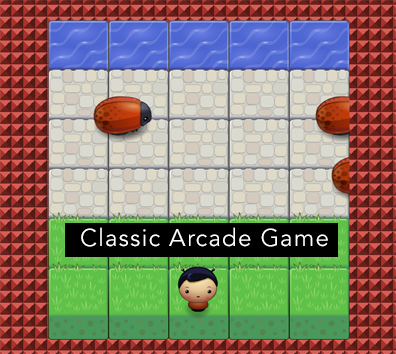

frontend-nanodegree-arcade-game
===============================

This project is for the Udacity Frontend Nanodegree

Objective of game
---------
The goal of the game is to cross the street with your avatar without getting run over by a beetle.

How to play
-----------
>just use your arrows in Keyboard :)

game screenshots
-----------

